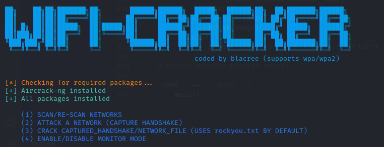

# Wifi_Cracker
## wifi_cracker.py (Tested on Kali-linux)
* Automates wifi cracking process using linux utilities for wpa and wpa2 wifi networks

## windows_wifi_password_extractor.py
* Extract wifi passwords from a windows machine

### screenshot

